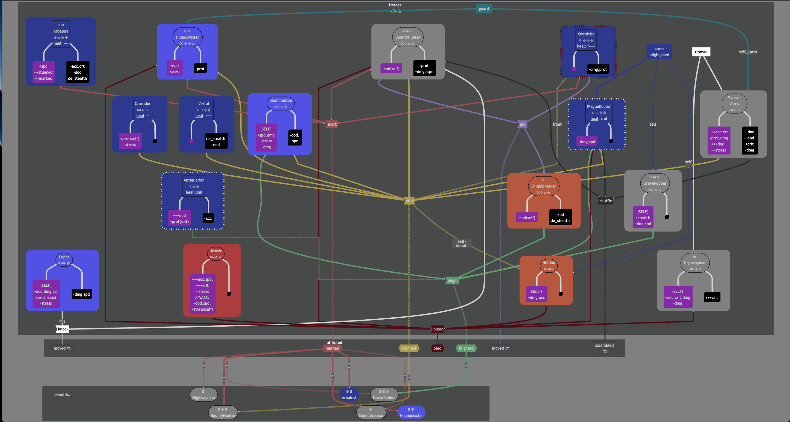

# gaminweeken
personal entertainment, gaming, docs help on games

Darkest Dungeon
===============

### Step to create diagram

Check that you have python
```shell
$ python --version
Python 3.12.4
```

Install `mermaid-cli` via python pip
```shell
$ python -m pip install mermaid-cli
```

Test make sure it's available
```shell
$ which mmdc
/path/someuser/.pyenv/shims/mmdc
```

Compose heroes & skills in [heroskills.md](./darkestdungeon/heroskills.md). 
Refer to [mermaid-js documentation](https://mermaid.js.org/syntax/flowchart.html)

Once done, generate the diagram

* Go inside `darkestdungeon` subfolder
    ```shell
    $ cd darkestdungeon/
    ```

* To output svg file (viewable on chrome)
    ```shell
    $ rm -f heroskills-1.svg && mmdc -i heroskills.md -e svg -b grey -o heroskills.svg
    Found 1 mermaid charts in Markdown input
      ✅ ./heroskills-1.svg
    ```
  for offense-defense graph
    ```shell
    $ mmdc -i offdef.md -e svg -b grey -o offdef.svg
    Found 1 mermaid charts in Markdown input
      ✅ ./offdef-1.svg
    ```

* To output png file
    ```shell
    $ rm -f heroskills-1.png && mmdc -i heroskills.md -e png -b grey -o heroskills.png -w 1000 -H 1000
    Found 1 mermaid charts in Markdown input
      ✅ ./heroskills-1.png
    ```
    Image quality could be very low though. Svg file is better.

Open the generated `heroskills-1.svg` in Google Chrome. It should look like this:



