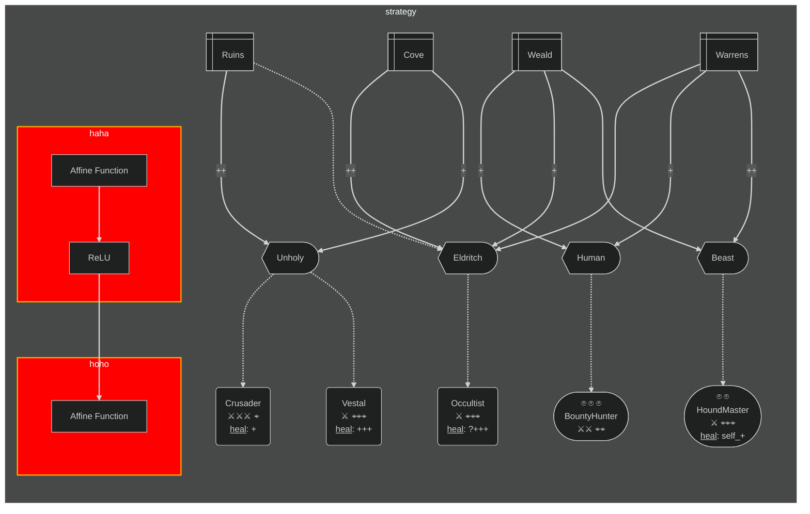

Example graph

Darkest dungeon heroes & skills mapping:

```mermaid
%%{ init: {
    'flowchart': {'nodeSpacing': 30, 'rankSpacing': 5, 'curve': 'basis'}, 
    'theme': 'dark', 'themeVariables': { 
        'fontSize': '14px'
    },
    "themeCSS": ".edge-thickness-normal {stroke-width: 3px !important;} p.skillof_Heal {background-color: #2c3291} p.skillof_HealSelf {background-color: #5343e8} p.skillof_default {background-color: #151517}"
} }%%

graph TB

    %% css default nodes %%
    classDef default stroke:#151517,fill:none;

    classDef nodePlain stroke:#fff,fill:#fff,color:#000;

    classDef nodeHeal stroke:#2c3291,fill:#2c3291;
    classDef nodeHealSml stroke:#fff,stroke-width:8px,fill:#2c3291,stroke-dasharray: 1 10;
    classDef nodeHealSelf stroke:#5343e8,fill:#5343e8;
    
    classDef nodeHeroTitle stroke:#151517,fill:none,font-size:16px,font-weight:bold;;
    
    classDef sgraphHeroHealSelf fill:#5343e8,color:#5343e8,rx:50,ry:50;
    
    classDef nodeBuff stroke:#8817ad,fill:#8817ad;
    classDef edgeBuff stroke:#8817ad,color:#8817ad;
    
    classDef nodeShuffle stroke:#296b0f,fill:#296b0f;
    classDef edgeShuffle stroke:#296b0f,color:#296b0f;
    
    classDef nodeCure stroke:#2c3291,fill:#2c3291;
    classDef edgeCure stroke:#2c3291,color:#2c3291;
    
    classDef nodeGuard stroke:#2a6f7d,fill:#2a6f7d;
    classDef edgeGuard stroke:#2a6f7d,color:#2a6f7d;
    
    classDef nodeStun stroke:#ad9d3e,fill:#ad9d3e;
    classDef edgeStun stroke:#ad9d3e,color:#ad9d3e;
    
    classDef nodeMark stroke:#9c4f4f,fill:#9c4f4f;
    classDef edgeMark stroke:#9c4f4f,color:#9c4f4f;
    
    classDef nodePull stroke:#8468ad,fill:#8468ad;
    classDef edgePull stroke:#8468ad,color:#8468ad;
    
    classDef nodeBlight stroke:#569c68,fill:#569c68;
    classDef edgeBlight stroke:#569c68,color:#569c68;
    
    classDef nodeDebuff stroke:#000,fill:#000,color:#fff;
    classDef edgeDebuff stroke:#000,color:#000;
    
    classDef nodeBleed stroke:#520b11,fill:#520b11;
    classDef edgeBleed stroke:#520b11,color:#520b11;
    
    
    subgraph _skills_
        direction LR
        
        guard[guard]
        
        %% css styling nodes %%
        class guard nodeGuard;
        
        subgraph _skills_a_[specific]
            direction LR
        
            cure[cure]
            stealth[stealth]
            riposte[riposte]
            
            cure ~~~ stealth
            
            %% css styling nodes %%
            class stealth nodePlain;
            class riposte nodePlain;
        end
        
        subgraph _skills_b_[common]
            direction LR
        
            buff[buff]
            de_buff[de_buff]
            heal[healer]
            
            heal ~~~ buff
            
            %% css styling nodes %%
            class de_buff nodeDebuff;
            class heal nodeHeal;
            class buff nodeBuff;
            class cure nodeCure;
        end
        
        _skills_a_ ~~~ _skills_b_
    end
    
    subgraph _heroes_
        direction LR
        
        Hwyman([#9022; <br>Highwayman<br>#9876;#9876; #8982;#8982;])
        BountyHunter([#9022; #9022; #9022; <br>BountyHunter<br>#9876;#9876; #8982;#8982;])
        GraveRobber([#9022; #9022; #9022; <br>GraveRobber<br>#9876;#9876; #8982;#8982;])
        
        %% Abomination ~~~ Doctor ~~~ Hwyman ~~~ BountyHunter ~~~ GraveRobber
        
        subgraph _complex_
            direction LR
            
            Doctor(PlagueDoctor<br>#9876; #8982;#8982;#8982;<br><u>heal</u>: sml)
            ManatArms([Man-at-Arms<br>#9876;#9876;#9876; #8982;])
            
            Crusader(Crusader<br>#9876;#9876;#9876; #8982;<br><u>heal</u>: +)
            Vestal(Vestal<br>#9876; #8982;#8982;#8982;<br><u>heal</u>: +++)
            Antiquarian(Antiquarian<br>#9876; #8982;#8982;<br><u>heal</u>: sml)
            Arbalest(#9022; #9022; <br>Arbalest<br>#8982;#8982;#8982;#8982;<br><u>heal</u>: ++)
            Occultist(Occultist<br>#9876; #8982;#8982;#8982;<br><u>heal</u>: ?+++)
            HoundMaster([#9022; #9022; <br>HoundMaster<br>#9876; #8982;#8982;#8982;<br><u>heal</u>: self_+])
            
            %% Leper used to be here..
            
            Abomination([Abomination<br>#9876;#9876; #8982;#8982;])
            
            %% Vestal ~~~ Arbalest ~~~ Antiquarian ~~~ Occultist ~~~ Crusader ~~~ HoundMaster
        end
        
        class Crusader nodeHeal;
        class Vestal nodeHeal;
        class Antiquarian nodeHealSml;
        class Arbalest nodeHeal;
        class Occultist nodeHealSml;
        class HoundMaster nodeHealSelf;
        class Doctor nodeHealSml;
        class Abomination nodeHealSelf;
    end
    class _heroes_ mySubgraphStyle;
    
    subgraph _specials_
        direction TB 
        
        subgraph _specials_a_[A]
            direction LR
            
            de_stealth>de_stealth]
            knock>knock]
            stun>stun]
            mark>mark]
            pull>pull]
            shuffle>shuffle]
            
            de_stealth ~~~ knock ~~~ stun ~~~ mark
        end
        
        subgraph _specials_c_[B]
            direction LR
            
            blight>blight]
            bleed>bleed]
            
            blight ~~~ bleed  
        end
        
        _specials_a_ ~~~ _specials_c_
        
        %% css styling nodes %%
        class de_stealth nodePlain;
        class knock nodePlain;
        class stun nodeStun;
        class mark nodeMark;
        class pull nodePull;
        class blight nodeBlight;
        class shuffle nodeShuffle;
        class bleed nodeBleed;
    end
    
    subgraph _affects_[afflicted]
        blighted{{blighted}}
        bled{{bled}}
    
        stunned{{stunned}}
        marked{{marked}}
        scrambled{{scrambled #8633;}}
        moved_fwd{{moved #8678;}}
        moved_bck{{moved #8680;}}
        
        %% css styling nodes %%
        class blighted nodeBlight;
        class bled nodeBleed;
        class stunned nodeStun;
        class marked nodeMark;
        %% class scrambled nodeShuffle;
    end
    
    subgraph _benefits_
        _na([n/a])
    
        _Hwyman([#9022; <br>Highwayman])
        _BountyHunter([#9022; #9022; #9022; <br>BountyHunter])
        _HoundMaster([#9022; #9022; <br>HoundMaster])
        _GraveRobber([#9022; #9022; #9022; <br>GraveRobber])
        _Arbalest([#9022; #9022; <br>Arbalest])
        
        class _HoundMaster nodeHealSelf;
        class _Arbalest nodeHeal;
    end
    
    _skills_a_ ~~~ _heroes_ ~~~ _specials_ ~~~ _affects_ ~~~ _benefits_
    %% _skills_a_ --> _skills_b_ 
    
    
    Abomination _blight_1@--- blight
    Abomination _stun_1@--- stun
    
    %% buff _buff_1@---|<p class="skillof_Heal"><u>PlagueDoctor</u><br>+dmg,spd<br>.<br>.</p>| Doctor
    cure _cure_1@---|blight,bleed| Doctor
    Doctor _blight_2@--- blight
    Doctor _bleed_1@--- bleed
    Doctor _stun_2@--- stun
    Doctor _shuffle_1@--- shuffle
    
    %% de_buff _debuff_1@---|<p class="skillof_Heal"><u>Occultist</u><br>-dmg,prot<br>.</p>| Occultist
    Occultist _stun_3@--- stun
    Occultist _mark_1@--- mark
    Occultist _pull_1@---|2#8612;| pull
    
    riposte ---|fwd:1| Hwyman
    Hwyman _bleed_2@--- bleed
    
    BountyHunter _bleed_3@--- bleed
    BountyHunter _mark_2@--- mark
    BountyHunter _pull_2@---|2#8612;| pull
    %% BountyHunter ---|#8680;2| knock
    
    cure _cure_2@---|self_<br>blight,bleed| GraveRobber
    stealth ---|self_<br>+++dmg,<br>+crt,dodge| GraveRobber
    GraveRobber _blight_3@--- blight
    
    %% buff _buff_7@---|<p class="skillof_HealSelf"><u>HoundMaster</u><br>-stress<br>.<br>.</p>| HoundMaster
    %% de_buff _debuff_2@---|<p class="skillof_HealSelf"><u>HoundMaster</u><br>-prot<br>.</p>| HoundMaster
    guard _guard_1@---|<u>HoundMaster</u><br>self_+dodge| HoundMaster
    HoundMaster _bleed_4@---|+Beast| bleed
    HoundMaster _mark_3@--- mark
    HoundMaster _stun_4@--- stun

    %% buff _buff_2@---|<p class="skillof_Heal"><u>Arbalest</u><br>+spd<br>.<br>.</p>| Arbalest    
    %% de_buff _debuff_3@---|<p class="skillof_Heal"><u>Arbalest</u><br>-acc,crt<br>-dodge:mark</p>| Arbalest
    Arbalest _mark_4@--- mark
    %% Arbalest ---|#8680;1| knock
    Arbalest ---|team:<br>-stun,marked| de_stealth
    
    %% buff _buff_3@---|<p class="skillof_Heal"><u>Antiquarian</u><br>+<u>dodge</u><br>+prot<br>.</p>| Antiquarian
    %% de_buff _debuff_4@---|<p class="skillof_Heal"><u>Antiquarian</u><br>-acc<br>.</p>| Antiquarian
    Antiquarian _blight_4@-.-|sml| blight
    
    %% de_buff _debuff_5@---|<p class="skillof_Heal"><u>Vestal</u><br>-stealth,dodge<br>.</p>| Vestal
    Vestal _stun_5@--- stun
    
    %% buff _buff_4@---|<p class="skillof_Heal"><u>Crusader</u><br>self_+prot<br>-<u>stress</u><br>.</p>| Crusader
    Crusader _stun_6@--- stun
    
    %% buff _buff_5@---|<p class="skillof_default"><u>Man-at-Arms</u><br>+<u>acc,crt</u><br>+<u>dmg_guarded</u><br>+<u>dodge,-stress</u></p>| ManatArms
    %% de_buff _debuff_6@---|<p class="skillof_default"><u>Man-at-Arms</u><br>-dodge,spd<br>.</p>| ManatArms
    riposte --- ManatArms
    guard _guard_2@---|<u>Man-at-Arms</u><br>self_+prot| ManatArms
    ManatArms _stun_7@---|#8680;1| stun
    %% ManatArms ---|#8680;1| knock
    ManatArms _shuffle_2@--- shuffle
    
    %% hero_Leper ---|#8680;3| knock
    
    
    blight _blight_5@-.-> blighted
    bleed _bleed_5@-.-> bled
    stun _stun_8@-.-> stunned
    mark _mark_5@-.-> marked
    shuffle _shuffle_3@-.-> scrambled
    pull _pull_3@-.-> moved_fwd
    knock -.-> moved_bck
    
    
    moved_bck ~~~ _na
    blighted _blight_6@--->|+| _GraveRobber
    stunned _stun_9@-.->|+| _BountyHunter
    marked _mark_6@-.->|+| _Hwyman
    marked _mark_7@--->|+++,<br>+Human| _BountyHunter
    marked _mark_8@-.->|+| _GraveRobber
    marked _mark_9@--->|++| _HoundMaster
    marked _mark_10@--->|++| _Arbalest
    
    
    class _buff_1,_buff_2,_buff_3,_buff_4,_buff_5,_buff_6,_buff_7 edgeBuff
    class _debuff_1,_debuff_2,_debuff_3,_debuff_4,_debuff_5,_debuff_6,_debuff_7 edgeDebuff
    
    class _cure_1 edgeCure
    class _cure_2 edgeCure
    
    class _guard_1,_guard_2 edgeGuard
    
    class _stun_1,_stun_2,_stun_3,_stun_4,_stun_5,_stun_6,_stun_7,_stun_8,_stun_9 edgeStun
    
    class _mark_1,_mark_2,_mark_3,_mark_4,_mark_5,_mark_6,_mark_7,_mark_8,_mark_9,_mark_10,_mark_11,_mark_12 edgeMark
    
    class _pull_1,_pull_2,,_pull_3 edgePull
    
    class _blight_1,_blight_2,_blight_3,_blight_4,_blight_5,_blight_6 edgeBlight
    
    class _shuffle_1,_shuffle_2,_shuffle_3 edgeShuffle
    
    class _bleed_1,_bleed_2,_bleed_3,_bleed_4,_bleed_5 edgeBleed
    
    %% subgraph _benefits_
    %%     direction RL
    %%     marked -.->|+| Hwyman;
    %% end

```

strategy:

```mermaid
%%{ init: {
    'flowchart': {'nodeSpacing': 90, 'rankSpacing': 65, 'curve': 'basis'}, 
    'theme': 'dark', 'themeVariables': { 
        'fontSize': '14px'
    },
    "themeCSS": ".edge-thickness-normal {stroke-width: 2px !important;} p.skillof_Heal {background-color: #2c3291} p.skillof_HealSelf {background-color: #5343e8} p.skillof_default {background-color: #151517}"
} }%%

flowchart TB

    classDef mySubgraphStyle fill:red,stroke:orange,stroke-width:2px;
    
    subgraph _strategy_[strategy]
        direction TB
        
        Ruins@{ shape: win-pane, label: "Ruins" }
        Cove@{ shape: win-pane, label: "Cove" }
        Weald@{ shape: win-pane, label: "Weald" }
        Warrens@{ shape: win-pane, label: "Warrens" }
        
        Beast@{ shape: curv-trap, label: "Beast" }
        Human@{ shape: curv-trap, label: "Human" }
        Unholy@{ shape: curv-trap, label: "Unholy" }
        Eldritch@{ shape: curv-trap, label: "Eldritch" }
        
        BountyHunter_([#9022; #9022; #9022; <br>BountyHunter<br>#9876;#9876; #8982;#8982;])
        Crusader_(Crusader<br>#9876;#9876;#9876; #8982;<br><u>heal</u>: +)
        HoundMaster_([#9022; #9022; <br>HoundMaster<br>#9876; #8982;#8982;#8982;<br><u>heal</u>: self_+])
        Occultist_(Occultist<br>#9876; #8982;#8982;#8982;<br><u>heal</u>: ?+++)
        Vestal_(Vestal<br>#9876; #8982;#8982;#8982;<br><u>heal</u>: +++)
        
        Ruins --->|++| Unholy
        Ruins -.-> Eldritch
        
        Cove --->|++| Eldritch
        Cove --->|+| Unholy
        
        Weald  --->|+| Human
        Weald  --->|+| Eldritch
        Weald  ---> Beast
        
        Warrens ---> Eldritch
        Warrens --->|+| Human
        Warrens --->|++| Beast
        
        Human -.-> BountyHunter_
        Unholy -.-> Crusader_
        Unholy -.-> Vestal_
        Beast -.-> HoundMaster_
        Eldritch -.-> Occultist_
        
        
        subgraph Layer1[haha]
            id1[Affine Function] --> id2[ReLU]
        end
        class Layer1 mySubgraphStyle;
    
        subgraph Layer2[hoho]
            id2 --> id3[Affine Function]
        end
        class Layer2 mySubgraphStyle;
        
    end

```

