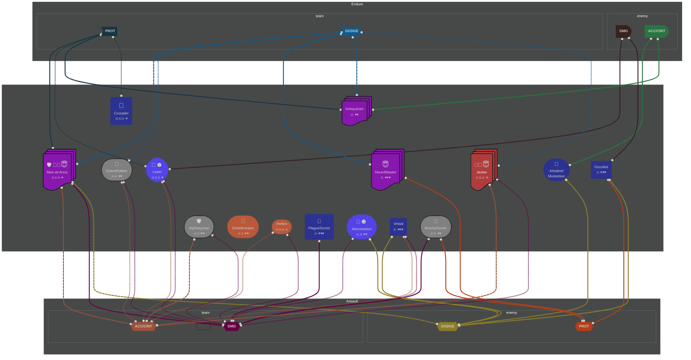

Darkest dungeon offense & defense tiers:

```mermaid
%%{ init: {
    'flowchart': {'nodeSpacing': 60, 'rankSpacing': 105, 'curve': 'basis'}, 
    'theme': 'dark', 'themeVariables': { 
        'fontSize': '16px'
    },
    "themeCSS": ".edge-thickness-normal {stroke-width: 4px !important;} .edgeLabel {line-height: 1.0 !important;} span.big_icons {font-size: 30px} span.med_icons {font-size: 24px}"
} }%%

graph TB
    %% css default nodes %%
    classDef default stroke:#151517,fill:none;
    
    classDef nodeHeal stroke:#2c3291,fill:#2c3291;
    classDef nodeHealSml stroke:#fff,stroke-width:14px,fill:#2c3291,stroke-dasharray: 1 10;
    
    classDef nodeHealSelf stroke:#5343e8,fill:#5343e8;
    classDef nodeHeroTitle stroke:#151517,fill:none,stroke-width:1px;
    classDef nodeHeroTeam stroke:#151517,fill:#8817ad,stroke-width:2px;
    classDef nodeHeroPlain stroke:#151517,fill:grey,stroke-width:1px;
    classDef nodeHeroArmorPierce stroke:#ba583a,fill:#ba583a;
    classDef nodeHeroFinale stroke:#151517,fill:#b03c3c,stroke-width:2px;
    
    %% Endure side
    
    classDef node_EndureEnemy_dmg stroke:#362220,fill:#362220;
    classDef edge_EndureEnemy_dmg stroke:#362220,color:#362220;
    
    classDef node_EndureEnemy_acc stroke:#297542,fill:#297542;
    classDef edge_EndureEnemy_acc stroke:#297542,color:#297542;
    
    classDef node_EndureTeam_dodge stroke:#105b8d,fill:#105b8d;
    classDef edge_EndureTeam_dodge stroke:#105b8d,color:#105b8d;
    
    classDef node_EndureTeam_prot stroke:#153642,fill:#153642;
    classDef edge_EndureTeam_prot stroke:#153642,color:#153642;
    
    %% Assault side
    
    classDef node_AssaultTeam_acc stroke:#9c523b,fill:#9c523b;
    classDef edge_AssaultTeam_acc stroke:#9c523b,color:#9c523b;
    
    classDef node_AssaultTeam_dmg stroke:#630040,fill:#630040;
    classDef edge_AssaultTeam_dmg stroke:#630040,color:#630040;
    
    classDef node_AssaultEnemy_dodge stroke:#8c7d27,fill:#8c7d27;
    classDef edge_AssaultEnemy_dodge stroke:#8c7d27,color:#8c7d27;
    
    classDef node_AssaultEnemy_prot stroke:#b53f18,fill:#b53f18;
    classDef edge_AssaultEnemy_prot stroke:#b53f18,color:#b53f18;
    
    
    subgraph _sgraph_endure_[Endure]
        direction LR 
        
        subgraph _sgraph_endure_enemy_[enemy]
            endure_stat_enemy_dmg@{ shape: delay, label: "<b>DMG</b>" }
            endure_stat_enemy_acc@{ shape: delay, label: "<b>ACC/CRIT</b>" }
            
            class endure_stat_enemy_dmg node_EndureEnemy_dmg;
            class endure_stat_enemy_acc node_EndureEnemy_acc;
        end
        
        subgraph _sgraph_endure_team_[team]
            endure_stat_team_prot><b>PROT</b>]
            endure_stat_team_dodge><b>DODGE</b>]
            
            class endure_stat_team_prot node_EndureTeam_prot;
            class endure_stat_team_dodge node_EndureTeam_dodge;
        end
    end
    
    subgraph _heroes_[ ]
        direction LR 
        
        _Arbalest([<span class="med_icons">#127939;</span><br>Arbalest/<br>Musketeer])
        _ManatArms@{ shape: docs, label: "<span class="med_icons">#128737;#65039; #127939;#127939;</span><span class="big_icons">#128519;</span><br>Man-at-Arms<br>#9876;#9876;#9876; #8982;"}
        _Leper([<span class="med_icons">#127939;</span><span class="big_icons">#9787;</span><br>Leper<br>#9876;#9876;#9876; #8982;])
        _Abomination([<span class="med_icons">#127939;</span><span class="big_icons">#9787;</span><br>Abomination<br>#9876;#9876; #8982;#8982;])
        _Doctor(<span class="med_icons">#127939;</span><br>PlagueDoctor<br>#9876; #8982;#8982;#8982;)
        _Occultist(Occultist<br>#9876; #8982;#8982;#8982;)
        _BountyHunter([<span class="med_icons">#127939;</span><br>BountyHunter<br>#9876;#9876; #8982;#8982;])
        _GraveRobber([<span class="med_icons">#128123;</span><br>GraveRobber<br>#9876;#9876; #8982;#8982;])
        _HoundMaster@{ shape: docs, label: "<span class="big_icons">#128519;</span><br>HoundMaster<br>#9876; #8982;#8982;#8982;"}
        _Antiquarian@{ shape: docs, label: "Antiquarian<br>#9876; #8982;#8982;"}
        _Vestal(Vestal<br>#9876; #8982;#8982;#8982;)
        _Crusader(<span class="big_icons">#128578;</span><br>Crusader<br>#9876;#9876;#9876; #8982;)
        _Hellion([Hellion<br>#9876;#9876;#9876;#9876;])
        _Jester@{ shape: docs, label: "<span class="med_icons">#127939;#127939;</span><span class="big_icons">#128519;</span><br>__Jester__<br>#9876;#9876;#9876; #8982;"}
        _Hwyman([<span class="med_icons">#128737;#65039;</span><br>Highwayman<br>#9876;#9876; #8982;#8982;])
        
        _Shieldbreaker([<span class="med_icons">#127939;</span><br>Shieldbreaker<br>#9876;#9876; #8982;#8982;])
        
        %% css styling hero nodes %%
        class _ManatArms nodeHeroTeam;
        class _HoundMaster nodeHeroTeam;
        class _Antiquarian nodeHeroTeam;
        class _Jester nodeHeroFinale;
        class _Arbalest nodeHeal;
        class _Vestal nodeHeal;
        class _Doctor nodeHeal;
        class _Occultist nodeHeal;
        class _Crusader nodeHeal;
        class _Leper nodeHealSelf
        class _Hwyman nodeHeroPlain
        class _Abomination nodeHealSelf
        class _BountyHunter nodeHeroPlain
        class _GraveRobber nodeHeroPlain
        %% class _Shieldbreaker nodeHeroArmorPierce
        class _Hellion nodeHeroArmorPierce
        class _Shieldbreaker nodeHeroArmorPierce
        
        _Crusader & _Antiquarian ~~~ _GraveRobber & _ManatArms & _Leper & _Arbalest & _Jester & _HoundMaster & _Occultist ~~~ _Hwyman & _Shieldbreaker & _Hellion & _Doctor & _Abomination & _Vestal & _BountyHunter   
        
        %% prettify
        
    end
    
    subgraph _sgraph_assault_[Assault]
        direction LR
        
        subgraph _sgraph_assault_enemy_[enemy]
            assault_stat_enemy_dodge{{<b>DODGE</b>}}
            assault_stat_enemy_prot{{<b>PROT</b>}}
            
            class assault_stat_enemy_dodge node_AssaultEnemy_dodge;
            class assault_stat_enemy_prot node_AssaultEnemy_prot;
        end
        
        subgraph _sgraph_assault_team[team]
            assault_stat_team_dmg{{<b>DMG</b>}}
            assault_stat_team_na1[ ]
            assault_stat_team_acc{{<b>ACC/CRIT</b>}}
           
            class assault_stat_team_dmg node_AssaultTeam_dmg; 
            class assault_stat_team_acc node_AssaultTeam_acc;
        end
    end
    
    %% setting heroes <-> stats
        
    %% Endure stats
    endure_stat_team_prot _ManatArms_e0@o--o _ManatArms
    endure_stat_team_dodge _ManatArms_e1@o--o _ManatArms
    %% endure_stat_enemy_dmg _ManatArms_e2@o--o _ManatArms
    %% Assault stats
    _ManatArms _ManatArms_e3@o--o assault_stat_team_acc
    _ManatArms _ManatArms_e4@o--o assault_stat_team_dmg
    _ManatArms _ManatArms_e5@o--o assault_stat_enemy_dodge
    %% styling
    _ManatArms_e1@{ animation: slow }
    _ManatArms_e3@{ animation: slow }
    _ManatArms_e5@{ animation: slow }
    class _ManatArms_e3 edge_AssaultTeam_acc;
    class _ManatArms_e4 edge_AssaultTeam_dmg;
    class _ManatArms_e5 edge_AssaultEnemy_dodge;
    class _ManatArms_e2 edge_EndureEnemy_dmg;
    class _ManatArms_e1 edge_EndureTeam_dodge;
    class _ManatArms_e0 edge_EndureTeam_prot;
    
    %% Endure stats
    endure_stat_team_prot _Leper_e1@o-.-o _Leper
    endure_stat_enemy_dmg _Leper_e2@o---o _Leper
    %% Assault stats
    _Leper _Leper_e3@o-.-o assault_stat_team_acc
    _Leper _Leper_e4@o-.-o assault_stat_team_dmg
    %% styling
    class _Leper_e3 edge_AssaultTeam_acc;
    class _Leper_e4 edge_AssaultTeam_dmg;
    class _Leper_e2 edge_EndureEnemy_dmg;
    class _Leper_e1 edge_EndureTeam_prot;
    
    %% Endure stats
    endure_stat_enemy_acc _Arbalest_e1@o--o _Arbalest
    %% Assault stats
    _Arbalest _Arbalest_e2@o--o assault_stat_enemy_dodge
    %% styling
    class _Arbalest_e2 edge_AssaultEnemy_dodge;
    class _Arbalest_e1 edge_EndureEnemy_acc;
    
    %% Endure stats
    %% Assault stats
    _Abomination _Abomination_e1@o-.-o assault_stat_team_dmg
    _Abomination _Abomination_e2@o--o assault_stat_enemy_dodge
    %% styling
    class _Abomination_e1 edge_AssaultTeam_dmg;
    class _Abomination_e2 edge_AssaultEnemy_dodge;
    
    %% Endure stats
    %% endure_stat_enemy_dmg _Doctor_e1@o--o _Doctor
    _Doctor _Doctor_e1@o--o assault_stat_team_dmg 
    %% Assault stats
    %% styling
    class _Doctor_e1 edge_AssaultTeam_dmg;
    
    %% Endure stats
    endure_stat_enemy_dmg _Occultist_e1@o--o _Occultist
    %% Assault stats
    _Occultist _Occultist_e2@o--o assault_stat_enemy_prot
    _Occultist _Occultist_e3@o--o assault_stat_enemy_dodge
    %% styling
    class _Occultist_e2 edge_AssaultEnemy_prot
    class _Occultist_e1 edge_EndureEnemy_dmg;
    class _Occultist_e3 edge_AssaultEnemy_dodge
    
    %% Endure stats
    %% Assault stats
    _BountyHunter _BountyHunter_e1@o--o assault_stat_team_dmg
    _BountyHunter _BountyHunter_e2@o--o assault_stat_enemy_prot
    %% styling
    class _BountyHunter_e2 edge_AssaultEnemy_prot
    class _BountyHunter_e1 edge_AssaultTeam_dmg;
    
    %% Endure stats
    endure_stat_team_dodge _GraveRobber_e1@o-.-o _GraveRobber
    _GraveRobber _GraveRobber_e2@o-.-o assault_stat_team_acc 
    _GraveRobber _GraveRobber_e3@o-.-o assault_stat_team_dmg 
    %% Assault stats
    %% styling
    class _GraveRobber_e1 edge_EndureTeam_dodge;
    class _GraveRobber_e2 edge_AssaultTeam_acc;
    class _GraveRobber_e3 edge_AssaultTeam_dmg;
    
    _HoundMaster
    %% Endure stats
    endure_stat_team_dodge _HoundMaster_e1@o--o _HoundMaster
    %% Assault stats
    _HoundMaster _HoundMaster_e2@o--o assault_stat_enemy_prot
    %% styling
    class _HoundMaster_e2 edge_AssaultEnemy_prot
    class _HoundMaster_e1 edge_EndureTeam_dodge;
    
    %% Endure stats
    endure_stat_team_prot _Antiquarian_e1@o--o _Antiquarian
    endure_stat_team_dodge _Antiquarian_e2@o--o _Antiquarian
    endure_stat_enemy_acc _Antiquarian_e3@o--o _Antiquarian
    %% Assault stats
    %% styling
    _Antiquarian_e2@{ animation: slow }
    class _Antiquarian_e3 edge_EndureEnemy_acc;
    class _Antiquarian_e2 edge_EndureTeam_dodge;
    class _Antiquarian_e1 edge_EndureTeam_prot;
    
    %% Endure stats
    %% Assault stats
    _Vestal _Vestal_e1@o--o assault_stat_enemy_dodge
    _Vestal _Vestal_e2@o-.-o assault_stat_team_acc
    _Vestal _Vestal_e3@o-.-o assault_stat_team_dmg
    %% styling
    class _Vestal_e1 edge_AssaultEnemy_dodge;
    class _Vestal_e2 edge_AssaultTeam_acc;
    class _Vestal_e3 edge_AssaultTeam_dmg;
    
    %% Endure stats
    endure_stat_team_prot _Crusader_e1@o-.-o _Crusader
    %% Assault stats
    %% styling
    class _Crusader_e1 edge_EndureTeam_prot;
    
    %% Endure stats - _Shieldbreaker none!
    %% Assault stats
    %% styling
    
    %% Endure stats
    %% Assault stats
    _Hellion _Hellion_e1@o-.-o assault_stat_team_acc
    _Hellion _Hellion_e2@o-.-o assault_stat_team_dmg
    %% styling
    class _Hellion_e1 edge_AssaultTeam_acc;
    class _Hellion_e2 edge_AssaultTeam_dmg;
    
    %% Endure stats
    endure_stat_team_dodge _Jester_e0@o-.-o _Jester
    %% Assault stats
    _Jester _Jester_e1@o-.-o assault_stat_team_acc
    _Jester _Jester_e2@o-.-o assault_stat_team_dmg
    %% styling
    %% _Jester_e1@{ animation: slow }
    class _Jester_e0 edge_EndureTeam_dodge;
    class _Jester_e1 edge_AssaultTeam_acc;
    class _Jester_e2 edge_AssaultTeam_dmg;
    _Jester_e1@{ animation: slow }
    
    %% Endure stats
    %% endure_stat_enemy_dmg _Hwyman_e1@o-.-o _Hwyman
    %% Assault stats
    _Hwyman _Hwyman_e2@o---o assault_stat_team_acc
    _Hwyman _Hwyman_e3@o-.-o assault_stat_team_dmg
    %% styling
    class _Hwyman_e2 edge_AssaultTeam_acc;
    class _Hwyman_e3 edge_AssaultTeam_dmg;
    _Hwyman_e2@{ animation: slow }    
        
        
```

