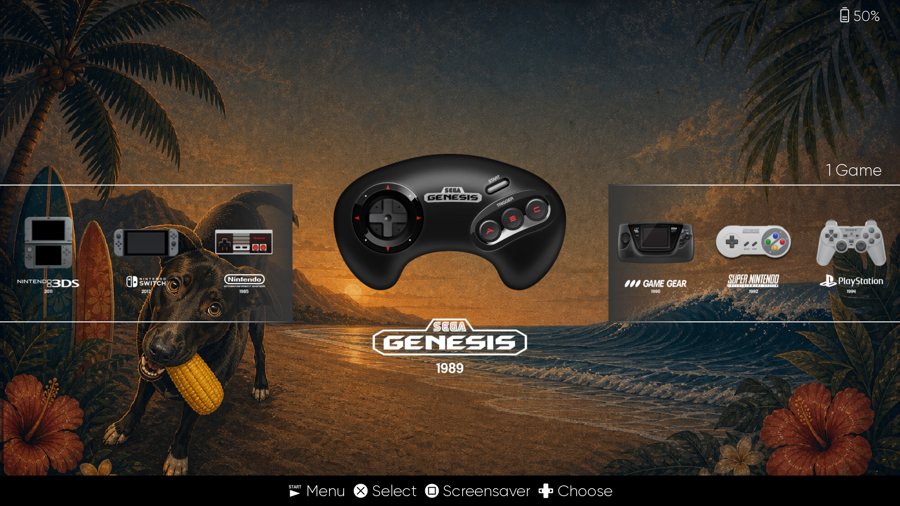
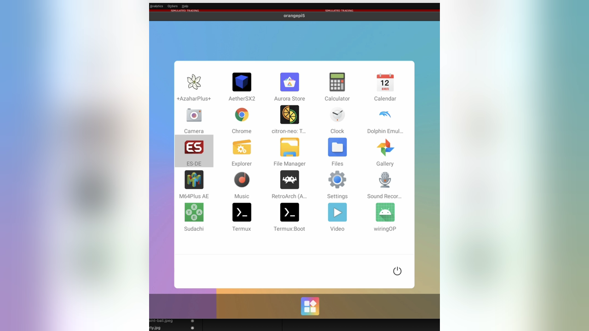

# RetroDroid

>> 🕰️ 1985. A hot afternoon, a 14-inch CRT, a world opening in phosphor glow. 📺🕹️
>
> We can't relive those days, but in the nostalgia these games carry, their joy lingers close.



## 🛠️ Why This Project Exists

To turn an [Orange Pi 5](http://www.orangepi.org/html/hardWare/computerAndMicrocontrollers/details/Orange-Pi-5.html)
into a console-style retro system without treating "maximum uniformity" as the only goal.

[Batocera](https://batocera.org/download) is cleaner, more unified, and easier to reason about as a traditional retro
appliance. This project deliberately gives up some of that neatness in exchange for better headroom on the systems
that benefit most from Android-native emulators and vendor GPU drivers.

That [rationale](./docs/rationale.md) behind the trade is the point of the project.

## Quick Setup

The end result runs
[Orange Pi OS](http://www.orangepi.org/html/hardWare/computerAndMicrocontrollers/service-and-support/Orange-pi-5.html)
as a console-style retro box with [ES-DE](https://es-de.org/) plus a curated
Android emulator stack. The point versus Batocera is simple: Batocera is cleaner and more unified, but Droid gets
better GPU driver support on RK3588, which matters for heavier systems like PS2, 3DS, and Switch.

### 1. Flash the OS
Manual.

You need to do this one a Windows machine. Flash the official Orange Pi Droid image to the SD card using the 
vendor tooling. Boot the board and finish the normal Android first-boot flow.

Before continuing, enable Android developer options and make sure `adb` debugging is available on the Droid.

### 2. Prepare the Host
Manual on the host.

Make sure these exist:

```bash
adb version
ssh -V
tar --version
python3 -m pip install requests
```

If you want a live screen for setup or debugging:

```bash
scrcpy [--no-audio]
# optional no-audio flag to not take over audio
```

### 3. Review Device Config
Manual on the host.

Edit:

```bash
config/droid-config.sh
```

Then load it:

```bash
. config/droid-config.sh
```

Important values after sourcing:
- `DROID_ADB_SERIAL`: the `adb` device target, for example `192.168.0.99:5555`
- `DROID_SSH_TARGET`: the SSH target, for example `u0_a77@192.168.0.99`
- `SSH_PORT`: Termux SSH port, normally `8022`

Quick sanity check:

```bash
echo "$DROID_ADB_SERIAL"
echo "$DROID_SSH_TARGET"
```

### 4. Connect ADB Over the Network
Manual on the host.

Connect to the Droid and confirm it is visible:

```bash
adb connect "$DROID_ADB_SERIAL"
adb devices
```

### 5. Install Utility Apps
Manual. Install from the host with `adb`, then finish first-run setup on the Droid.

Reference pages:
- `Termux` homepage: https://f-droid.org/en/packages/com.termux/
- `Termux` APK used in this setup: https://f-droid.org/repo/com.termux_1002.apk
- `Key Mapper` homepage: https://f-droid.org/en/packages/io.github.sds100.keymapper/
- `Key Mapper` APK used in this setup: https://f-droid.org/repo/io.github.sds100.keymapper_256.apk

Install from the host:

```bash
adb -s "$DROID_ADB_SERIAL" install ~/Downloads/com.termux_1002.apk
adb -s "$DROID_ADB_SERIAL" install ~/Downloads/io.github.sds100.keymapper_256.apk
```

If you want SSH after reboot, install `Termux:Boot` too.

### 6. Initialize Termux
Manual on the Droid.

1. Open `Termux` once.
2. Run:

```bash
pkg update && pkg upgrade -y
pkg install openssh python iproute2 rsync htop -y
passwd
sshd
```

Termux SSH listens on port `8022`.

If you want SSH after reboot, create `~/.termux/boot/start-sshd` manually:

```sh
#!/data/data/com.termux/files/usr/bin/sh
termux-wake-lock
sshd
```

Then make it executable:

```bash
chmod +x ~/.termux/boot/start-sshd
```

### 7. Enable SSH After Reboot
Manual on the Droid, then optional host step.

Launch the `Termux:Boot` app from the Android application drawer at least once manually. This registers the app with
Android's startup triggers, and SSH-after-reboot will not work until you do it.

Reference screenshot of the app drawer:



Optional but recommended: copy your SSH key now that Termux `sshd` is running.

```bash
ssh-copy-id -p "$SSH_PORT" "$DROID_SSH_TARGET"
```

### 8. Optional APK Refresh
Scripted on the host.

If you want to refresh the downloadable emulator APK cache:

```bash
./download_apks.sh --dryrun
```

If you have a locally obtained ES-DE APK, place it under:

```text
artifacts/apks/
```

### 9. Buy and Provide ES-DE
Manual.

Before the main setup, buy ES-DE once from:

- https://es-de.org/

Then place the APK you received under:

```text
artifacts/apks/
```

The main setup script requires this APK and will fail if it is missing.

### 10. Run the Main Setup
Scripted on the host.

```bash
./setup_droid.sh --dryrun
./setup_droid.sh
```

What this does:
- streams the tracked setup scripts to the Droid
- creates the core folder layout under `/sdcard/RetroGames`
- installs tracked emulator APKs over `adb`
- installs optional ES-DE custom system XMLs
- installs the `watch_cpu` shell helper in Termux

What this does not do:
- it does not complete Android app permission prompts for you
- it does not fully configure ES-DE emulator routing for you
- it does not install manual utility apps like `Termux`, `Termux:Boot`, or `Key Mapper`

### 11. Launch ES-DE Once
Manual on the Droid.

1. Open `ES-DE`.
2. Point it at:

```text
/sdcard/RetroGames/ROMs/
```

3. Let it build its initial folders and scan.

On this Droid build, `/sdcard/` and `/storage/emulated/0/` refer to the same shared storage.
This repo uses `/sdcard/` as the canonical path in docs.

### 12. Install RetroArch Cores
Scripted on the host, then manual in RetroArch.

Install the shared core files:

```bash
./setup_retroarch.sh --serial "$DROID_ADB_SERIAL"
```

Then open `RetroArch` manually and use `Load Core` once for each core you plan to launch from ES-DE.

### 13. Check BIOS / Firmware
Scripted on the host.

```bash
./check_retroarch_bios.sh --serial "$DROID_ADB_SERIAL"
```

This validates the current RetroArch-side BIOS files against Batocera checksum references for the
systems the checker supports.

### 14. Configure Emulator Routing
Manual on the Droid.

Use:

- [es-de-mapping.md](./es-de-mapping.md)

This is where you choose which standalone emulator or RetroArch target each system should use.

### 15. Key Mapper First Setup / Restore
Manual on the Droid, plus optional host push.

Open `Key Mapper` once and grant the permissions it asks for.

The current Key Mapper backup under `artifacts/keymapper/*.zip` has the following mappings from the 8bitdo pro 2 
controller:
- `hotkey` (the little button under West/East/South/North buttons) = go back while playing in any emulator. This brings
up the emulator's system menu for you to customize things/exit game/etc
- `Select` + L3 + R3 = take screenshot
- While in ES-DE, hold `hotkey` + Select = bring up Power menu, then:
  - L1 to restart
  - R1 to shutdown
- `Select` + L1 = - volume
- `Select` + R1 = + volume
- `Select` + L2 = - screen brightness
- `Select` + R2 = + screen brightness

push it from host:

```bash
adb -s "$DROID_ADB_SERIAL" shell mkdir -p /sdcard/Download/retrodroid/keymapper
adb -s "$DROID_ADB_SERIAL" push artifacts/keymapper/keymapper-backup.zip /sdcard/Download/retrodroid/keymapper/
```

Then import it manually inside `Key Mapper`.

### 16. Make It Feel Like a Console
Manual on the Droid, plus optional host commands for maintenance. 

On the Droid:
1. Set `ES-DE` as the default home app in Android settings.
2. In Droid OS taskbar settings, disable `Allows taskbar to perform button press actions`.
3. In Droid OS taskbar settings, disable its ability to display over other apps.

You can also make the taskbar disappear by running this from host:

```bash
adb -s "$DROID_ADB_SERIAL" shell cmd appops set com.farmerbb.taskbar.androidx86 SYSTEM_ALERT_WINDOW deny
```

To bring the taskbar back, run from host:

```bash
adb -s "$DROID_ADB_SERIAL" shell cmd appops set com.farmerbb.taskbar.androidx86 SYSTEM_ALERT_WINDOW allow
adb -s "$DROID_ADB_SERIAL" shell am start -n com.farmerbb.taskbar.androidx86/com.farmerbb.taskbar.MainActivity
```

## ROM Placement

Put ROMs under:

```text
/sdcard/RetroGames/ROMs/<system>/
```

Exact ES-DE routing expectations are in [es-de-mapping.md](./es-de-mapping.md).

## Notes

- `watch_cpu` is installed into Termux shell startup by the setup pipeline. Open a new
  Termux or SSH bash session and run:

```bash
watch_cpu
```

- PS Vita is not a plain ROM-folder system in the same way NES/SNES are.
  Install Vita games through Vita3K's own supported flow.

## Host Utility

### Group BIOS / Firmware

`scripts/organize_bios_stash.py` is not part of the main setup flow.

It recursively scans a host directory of BIOS / firmware files, matches known files
against Batocera BIOS definitions, sorts recognized files into per-system folders,
and moves unmatched files into `_review/`.

This is useful when a user has a messy BIOS stash and wants it accounted into
systems before copying anything onto the Droid. AI agents working in this repo
should use this script for that kind of BIOS-organization task.

### Check audio at the droid

```shell
# shows the current music route and per-device volume indexes
$ adb -s "$DROID_ADB_SERIAL" shell 'dumpsys audio | sed -n "/STREAM_MUSIC:/,/STREAM_ALARM:/p"'

# check what current output is & volumen
$ adb -s "$DROID_ADB_SERIAL" shell 'cmd media_session volume --stream 3 --get'
$ adb -s "$DROID_ADB_SERIAL" shell 'dumpsys audio | grep -A 8 "STREAM_MUSIC:"'
```


