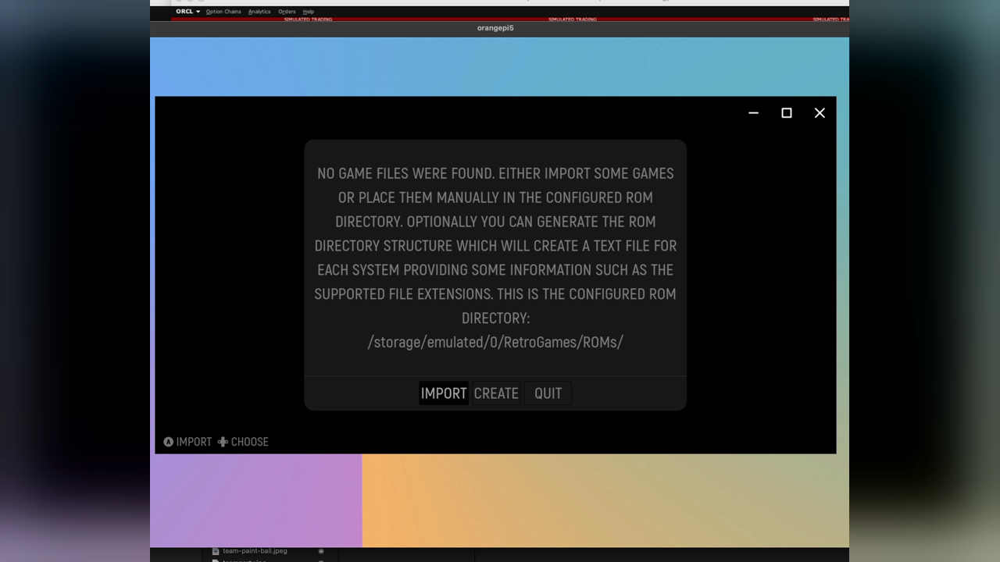

# ES-DE Frontend Mapping Reference

This document describes the ES-DE routing plan for this repo's Android/Droid setup on Orange Pi 5.

The goal is simple:
- use `RetroArch` for older systems where a libretro core is fine
- use standalone emulators for heavier systems where Android-native apps perform better

## The Decision Layers

There are two separate routing layers. Mixing them up is what makes this setup confusing.

1. `ES-DE`
   Chooses which emulator application to launch for a system or a specific game.
2. `RetroArch`
   If ES-DE launches RetroArch, RetroArch must have a matching libretro core installed.

So:
- `ES-DE` has a built-in core download/install feature for some supported systems. This repo's setup script automates core installation for part of that set, such as `nes` and `snes`.
- `RetroArch` does not decide your ES-DE system routing.
- If `nes` is mapped to a RetroArch option in ES-DE, RetroArch still needs an NES core installed.

## First Launch

1. Launch ES-DE once so it can create its working folders.

2. When prompted, point ES-DE at the ROM root:
   `/sdcard/RetroGames/ROMs/`



After initialization, ES-DE will create the console subdirectories under this path:
```shell
~ $ ls -A /sdcard/RetroGames/ROMs/
.nomedia      arcade       atomiswave     cps3       fbneo         genesis        megacd       multivision  ngp         pico8     satellaview  snesna        tg16        vsmile           zmachine
3do           arcadia      bbcmicro       crvision   fds           gmaster        megacdjp     n3ds         ngpc        plus4     saturn       spectravideo  ti99        wasm4            zx81
3ds           archimedes   c64            daphne     flash         gx4000         megadrive    n64          odyssey2    pokemini  saturnjp     steam         tic80       wii              zxspectrum
adam          arduboy      cdimono1       doom       fm7           intellivision  megadrivejp  n64dd        openbor     ports     scummvm      stv           to8         wiiu
...
```

3. After the first scan completes, open:
   `Start -> Alternative Emulators`

On this Droid build, `/sdcard/` and `/storage/emulated/0/` refer to the same shared storage.
This repo uses `/sdcard/` as the canonical path in docs.

## Global Mapping Table

Use these default mappings in ES-DE.

| ES-DE system | ROM folder | Default emulator | Notes |
| --- | --- | --- | --- |
| `nes` | `/sdcard/RetroGames/ROMs/nes/` | `RetroArch` | Use the default ES-DE RetroArch path. |
| `snes` | `/sdcard/RetroGames/ROMs/snes/` | `RetroArch` | Use the default ES-DE RetroArch path. |
| `genesis` | `/sdcard/RetroGames/ROMs/genesis/` | `RetroArch` | Use the default ES-DE RetroArch path. |
| `dreamcast` | `/sdcard/RetroGames/ROMs/dreamcast/` | `RetroArch` | Use the default ES-DE RetroArch path. |
| `ps1` | `/sdcard/RetroGames/ROMs/ps1/` | `RetroArch` / `DuckStation (Standalone)` | Use the default ES-DE RetroArch path, or switch to DuckStation if preferred. |
| `n64` | `/sdcard/RetroGames/ROMs/n64/` | `Mupen64Plus AE (Standalone)` | Preferred over a RetroArch N64 core. |
| `gc` | `/sdcard/RetroGames/ROMs/gc/` | `Dolphin (Standalone)` | Preferred for GameCube. |
| `wii` | `/sdcard/RetroGames/ROMs/wii/` | `Dolphin (Standalone)` | Create this folder manually if you want Wii titles. |
| `3ds` | `/sdcard/RetroGames/ROMs/3ds/` | `Azahar Plus (Standalone)` | If ES-DE shows `Citra` instead and that is what you installed, use that. |
| `ps2` | `/sdcard/RetroGames/ROMs/ps2/` | `AetherSX2 (Standalone)` | Use the standalone PS2 app. |
| `switch` | `/sdcard/RetroGames/ROMs/switch/` | `Citron (Standalone)` | Recommended if both Citron and Sudachi are installed. |

## RetroArch Systems

For systems you keep on RetroArch, there are two things to configure:

1. ES-DE must route the system to a RetroArch-backed emulator choice.
2. RetroArch must already have the matching core installed.

Recommended starting point:

| System | ES-DE target | RetroArch requirement | Optional better emulator |
| --- | --- | --- | --- |
| `nes` | `RetroArch::FCEUmm` | `fceumm_libretro_android.so` must be installed | |
| `snes` | `RetroArch::Snes9x` | `snes9x_libretro_android.so` must be installed | |
| `genesis` | `RetroArch::Genesis Plus GX` | `genesis_plus_gx_libretro_android.so` must be installed | |
| `ps1` | `RetroArch::SwanStation` | `swanstation_libretro_android.so` must be installed | [DuckStation (Standalone)](https://www.apkmirror.com/apk/stenzek/duckstation/) |
| `dreamcast` | `RetroArch::Flycast` | `flycast_libretro_android.so` must be installed | |

This repo now includes a host script to install that baseline RetroArch core set:

```bash
./setup_retroarch.sh
```
This installs the core `.so` and `.info` files into RetroArch's shared writable storage.
After running it, open RetroArch once and use `Load Core` for each system you plan to launch
from ES-DE.

A separate host-side script checks the BIOS / firmware files still needed by the
RetroArch-backed systems that commonly require them:

```bash
./check_retroarch_bios.sh
```

If you have multiple adb devices connected:

```bash
. config/droid-config.sh
./setup_retroarch.sh --serial "$DROID_ADB_SERIAL"
```

## Alternate Emulator Cases & First Run

These systems may reasonably have more than one installed emulator.

| System | Preferred default | Alternate choice | When to switch |
| --- | --- | --- | --- |
| `switch` | `Citron (Standalone)` | `Sudachi (Standalone)` | Try Sudachi for a specific title if Citron has compatibility problems. |
| `3ds` | `Azahar Plus (Standalone)` | `Citra (Standalone)` | Only if you installed Citra separately and prefer it for a specific game. |
| `ps2` | `AetherSX2 (Standalone)` | `NetherSX2 (Standalone)` | Only if you choose to install NetherSX2 later. |

For RetroArch-routed systems, these ES-DE targets are currently the best choices:

- `snes` -> `RetroArch::Snes9x`
- `genesis` -> `RetroArch::Genesis Plus GX`
- `dreamcast` -> `RetroArch::Flycast`

For each standalone emulator, launch the app once and complete its first-run setup. This may include:
- importing BIOS files, firmware, or title data
- selecting its ROM folder
- completing any other emulator-specific setup steps
- launching a game once from inside the emulator to confirm it works

After that, configure the desired `Alternative Emulator` for each platform in ES-DE. ES-DE is essentially a launch hub
that starts the target emulator app for the relevant games.

## BIOS / Firmware Notes

For the current RetroArch core set:

- `nes` / `snes` / `genesis` do not need BIOS files for the chosen cores
- `ps1` with `SwanStation` should have a PS1 BIOS under `/sdcard/RetroArch/system/`
- `dreamcast` with `Flycast` should have `dc_boot.bin` and `dc_flash.bin` under `/sdcard/RetroArch/system/`

Use the host-side checker to validate what is missing:

```bash
./check_retroarch_bios.sh
```

## ROM Folder Notes

If you want ES-DE entries for consoles that are not created by default, create those folders manually:

```bash
mkdir -p /sdcard/RetroGames/ROMs/switch
mkdir -p /sdcard/RetroGames/ROMs/wii
```

Creating these folders under the ES-DE ROM root allows ES-DE to scan and display those games. You still need to
complete the per-emulator setup process and install any required system files.
